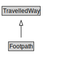

# Footpath

A Footpath is a type of TravelledWay that is made up of FootpathLinks.

<a href="diagrams/Footpath.dot.svg">Open interactive Footpath diagram</a>

## Formalization for Footpath

| Property | Constraint |
|----------|------------|
| cdm1:hasProperPart | all FootpathLink |
| cdm1:hasProperPart | min 1 owl:Thing |
| cdm1:properPartOf | all FootpathNetwork |
| subClassOf | TravelledWay |

## Other annotations

| Property | Value |
|----------|-------|
| xsd:pattern | PedestrianNetworkPattern |

