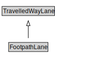

# FootpathLane

A FootpathLane is a type of TravelledWayLane that forms part of a FootpathSegment.

<a href="diagrams/FootpathLane.dot.svg">Open interactive FootpathLane diagram</a>

## Formalization for FootpathLane

| Property | Constraint |
|----------|------------|
| cdm1:properPartOf | all FootpathSegment |
| cdm1:properPartOf | min 1 owl:Thing |
| subClassOf | TravelledWayLane |

## Used by classes

| Class | Property |
|-------|----------|
| [Footpath Segment](FootpathSegment.md) | cdm1:hasProperPart |

## Other annotations

| Property | Value |
|----------|-------|
| xsd:pattern | PedestrianNetworkPattern |

