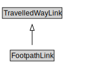

# FootpathLink

A Footpath Link is a type of TravelledWayLink designed for pedestrians.

<a href="diagrams/FootpathLink.dot.svg">Open interactive FootpathLink diagram</a>

## Formalization for FootpathLink

| Property | Constraint |
|----------|------------|
| cdm1:hasProperPart | all FootpathSegment |
| cdm1:hasProperPart | min 1 owl:Thing |
| cdm1:properPartOf | all Footpath or FootpathNetwork or FootpathSection |
| subClassOf | TravelledWayLink |

## Used by classes

| Class | Property |
|-------|----------|
| [Footpath](Footpath.md) | cdm1:hasProperPart |

## Other annotations

| Property | Value |
|----------|-------|
| xsd:pattern | PedestrianNetworkPattern |

