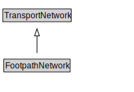

# FootpathNetwork

A FootpathNetwork is a type of TransportNetwork designed for the use of pedestrians but may be used by others as well.

<a href="diagrams/FootpathNetwork.dot.svg">Open interactive FootpathNetwork diagram</a>

## Formalization for FootpathNetwork

| Property | Constraint |
|----------|------------|
| cdm1:hasProperPart | all Footpath or FootpathLink or FootpathSection |
| cdm1:hasProperPart | min 1 owl:Thing |
| subClassOf | TransportNetwork |

## Used by classes

| Class | Property |
|-------|----------|
| [Footpath](Footpath.md) | cdm1:properPartOf |
| [Footpath Section](FootpathSection.md) | cdm1:properPartOf |

## Other annotations

| Property | Value |
|----------|-------|
| xsd:pattern | PedestrianNetworkPattern |

