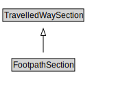

# FootpathSection

A FootpathSection is a type of TravelledWaySection that groups FootpathLinks and FootpathSegments for a useful operational purpose.

<a href="diagrams/FootpathSection.dot.svg">Open interactive FootpathSection diagram</a>

## Formalization for FootpathSection

| Property | Constraint |
|----------|------------|
| cdm1:hasProperPart | all FootpathLink or FootpathSegment |
| cdm1:properPartOf | all FootpathNetwork |
| subClassOf | TravelledWaySection |

## Other annotations

| Property | Value |
|----------|-------|
| xsd:pattern | PedestrianNetworkPattern |

