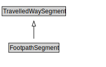

# FootpathSegment

A FootpathSegment is a type of TravelledWaySegment that represents a portion of a FootpathLink with common physical characteristics.

<a href="diagrams/FootpathSegment.dot.svg">Open interactive FootpathSegment diagram</a>

## Formalization for FootpathSegment

| Property | Constraint |
|----------|------------|
| cdm1:hasProperPart | all FootpathLane |
| cdm1:hasProperPart | min 1 owl:Thing |
| cdm1:properPartOf | all FootpathLink or FootpathSection |
| cdm1:properPartOf | min 1 owl:Thing |
| subClassOf | TravelledWaySegment |

## Used by classes

| Class | Property |
|-------|----------|
| [Footpath Lane](FootpathLane.md) | cdm1:properPartOf |
| [Footpath Link](FootpathLink.md) | cdm1:hasProperPart |

## Other annotations

| Property | Value |
|----------|-------|
| xsd:pattern | PedestrianNetworkPattern |

