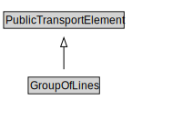

# GroupOfLines

A GroupOfLines is a logical grouping of PublicTransportLines for any useful purpose.

<a href="diagrams/GroupOfLines.dot.svg">Open interactive GroupOfLines diagram</a>

## Formalization for GroupOfLines

| Property | Constraint |
|----------|------------|
| cdm1:hasProperPart | all PublicTransportLine |
| cdm1:hasProperPart | min 1 owl:Thing |
| cdm1:properPartOf | all PublicTransportSystem |
| subClassOf | PublicTransportElement |

