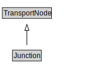

# Junction

A Junction is a TransportNode that allows a traveller to connect from one TravelledWayLink to another.

<a href="diagrams/Junction.dot.svg">Open interactive Junction diagram</a>

## Formalization for Junction

| Property | Constraint |
|----------|------------|
| subClassOf | TransportNode |

## Other annotations

| Property | Value |
|----------|-------|
| xsd:pattern | TransportNetworkPattern |

