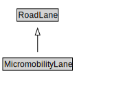

# MicromobilityLane

A MicromobilityLane is a type of RoadLane that forms part of a MicromobilityPathSegment.

<a href="diagrams/MicromobilityLane.dot.svg">Open interactive MicromobilityLane diagram</a>

## Formalization for MicromobilityLane

| Property | Constraint |
|----------|------------|
| cdm1:properPartOf | all MicromobilityPathSegment |
| cdm1:properPartOf | min 1 owl:Thing |
| subClassOf | RoadLane |

## Used by classes

| Class | Property |
|-------|----------|
| [Micromobility Path Segment](MicromobilityPathSegment.md) | cdm1:hasProperPart |

## Other annotations

| Property | Value |
|----------|-------|
| xsd:pattern | MicromobilityNetworkPattern |

