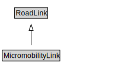

# MicromobilityLink

A MicromobilityLink is a type of RoadLink designed for micromobility vehicles.

<a href="diagrams/MicromobilityLink.dot.svg">Open interactive MicromobilityLink diagram</a>

## Formalization for MicromobilityLink

| Property | Constraint |
|----------|------------|
| cdm1:hasProperPart | all MicromobilityPathSegment |
| cdm1:hasProperPart | min 1 owl:Thing |
| cdm1:properPartOf | all MicromobilityNetwork or MicromobilityPath or MicromobilityPathSection |
| subClassOf | RoadLink |

## Used by classes

| Class | Property |
|-------|----------|
| [Micromobility Path](MicromobilityPath.md) | cdm1:hasProperPart |

## Other annotations

| Property | Value |
|----------|-------|
| xsd:pattern | MicromobilityNetworkPattern |

