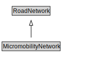

# MicromobilityNetwork

A MicromobilityNetwork is a type of RoadNetwork designed for the use of micromobility vehicles, which have more limited performance characteristics than motor vehicles.

<a href="diagrams/MicromobilityNetwork.dot.svg">Open interactive MicromobilityNetwork diagram</a>

## Formalization for MicromobilityNetwork

| Property | Constraint |
|----------|------------|
| cdm1:hasProperPart | all MicromobilityLink or MicromobilityPath or MicromobilityPathSection |
| cdm1:hasProperPart | min 1 owl:Thing |
| subClassOf | RoadNetwork |

## Used by classes

| Class | Property |
|-------|----------|
| [Micromobility Path](MicromobilityPath.md) | cdm1:properPartOf |
| [Micromobility Path Section](MicromobilityPathSection.md) | cdm1:properPartOf |

## Other annotations

| Property | Value |
|----------|-------|
| xsd:pattern | MicromobilityNetworkPattern |

