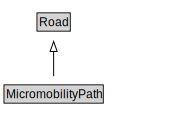

# MicromobilityPath

A MicromobilityPath is a type of Road that is made up of MicromobilityPathLinks.

<a href="diagrams/MicromobilityPath.dot.svg">Open interactive MicromobilityPath diagram</a>

## Formalization for MicromobilityPath

| Property | Constraint |
|----------|------------|
| cdm1:hasProperPart | all MicromobilityLink |
| cdm1:hasProperPart | min 1 owl:Thing |
| cdm1:properPartOf | all MicromobilityNetwork |
| subClassOf | Road |

## Other annotations

| Property | Value |
|----------|-------|
| xsd:pattern | MicromobilityNetworkPattern |

