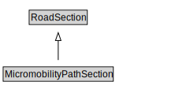

# MicromobilityPathSection

A MicromobilityPathSections is a type of RoadSection that groups MicromobilityLinks and MicromobilityPathSegments for a useful operational purpose (e.g., assigning a speed limit, designating areas of shared use).

<a href="diagrams/MicromobilityPathSection.dot.svg">Open interactive MicromobilityPathSection diagram</a>

## Formalization for MicromobilityPathSection

| Property | Constraint |
|----------|------------|
| cdm1:hasProperPart | all MicromobilityLink or MicromobilityPathSegment |
| cdm1:properPartOf | all MicromobilityNetwork |
| subClassOf | RoadSection |

## Other annotations

| Property | Value |
|----------|-------|
| xsd:pattern | MicromobilityNetworkPattern |

