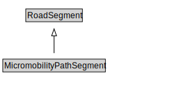

# MicromobilityPathSegment

A MicromobilityPathSegment is a type of RoadSegment that represents a portion of a MicromobilityLink with common physical characteristics.

<a href="diagrams/MicromobilityPathSegment.dot.svg">Open interactive MicromobilityPathSegment diagram</a>

## Formalization for MicromobilityPathSegment

| Property | Constraint |
|----------|------------|
| cdm1:hasProperPart | all MicromobilityLane |
| cdm1:hasProperPart | min 1 owl:Thing |
| cdm1:properPartOf | all MicromobilityLink or MicromobilityPathSection |
| cdm1:properPartOf | min 1 owl:Thing |
| subClassOf | RoadSegment |

## Used by classes

| Class | Property |
|-------|----------|
| [Micromobility Lane](MicromobilityLane.md) | cdm1:properPartOf |
| [Micromobility Link](MicromobilityLink.md) | cdm1:hasProperPart |

## Other annotations

| Property | Value |
|----------|-------|
| xsd:pattern | MicromobilityNetworkPattern |

