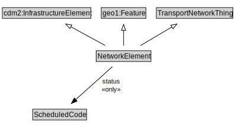

# NetworkElement

A NetworkElement represents any element of a transport network. It can be a part of another NetworkElement and can be decomposed into smaller NetworkElements.

<a href="diagrams/NetworkElement.dot.svg">Open interactive NetworkElement diagram</a>

## Specializations of NetworkElement

| Class | Description |
|-------|-------------|
| [Footpath](Footpath.md) | A Footpath is a type of TravelledWay that is made up of FootpathLinks. |
| [Footpath Lane](FootpathLane.md) | A FootpathLane is a type of TravelledWayLane that forms part of a FootpathSegment. |
| [Footpath Link](FootpathLink.md) | A Footpath Link is a type of TravelledWayLink designed for pedestrians. |
| [Footpath Network](FootpathNetwork.md) | A FootpathNetwork is a type of TransportNetwork designed for the use of pedestrians but may be used by others as well. |
| [Footpath Section](FootpathSection.md) | A FootpathSection is a type of TravelledWaySection that groups FootpathLinks and FootpathSegments for a useful operational purpose. |
| [Footpath Segment](FootpathSegment.md) | A FootpathSegment is a type of TravelledWaySegment that represents a portion of a FootpathLink with common physical characteristics. |
| [Junction](Junction.md) | A Junction is a TransportNode that allows a traveller to connect from one TravelledWayLink to another. |
| [Micromobility Lane](MicromobilityLane.md) | A MicromobilityLane is a type of RoadLane that forms part of a MicromobilityPathSegment. |
| [Micromobility Link](MicromobilityLink.md) | A MicromobilityLink is a type of RoadLink designed for micromobility vehicles. |
| [Micromobility Network](MicromobilityNetwork.md) | A MicromobilityNetwork is a type of RoadNetwork designed for the use of micromobility vehicles, which have more limited performance characteristics than motor vehicles. |
| [Micromobility Path](MicromobilityPath.md) | A MicromobilityPath is a type of Road that is made up of MicromobilityPathLinks. |
| [Micromobility Path Section](MicromobilityPathSection.md) | A MicromobilityPathSections is a type of RoadSection that groups MicromobilityLinks and MicromobilityPathSegments for a useful operational purpose (e.g., assigning a speed limit, designating areas of shared use). |
| [Micromobility Path Segment](MicromobilityPathSegment.md) | A MicromobilityPathSegment is a type of RoadSegment that represents a portion of a MicromobilityLink with common physical characteristics. |
| [Rail Corridor](RailCorridor.md) | A RailCorridor is a type of TravelledWay that is made up of TrackLinks. |
| [Rail Network](RailNetwork.md) | A RailNetwork is a type of TransportNetwork using rails on a stabilized base. |
| [Rail Section](RailSection.md) | A RailSection is a type of TravelledWaySection that groups TrackLinks and TrackSegments for a useful operational purpose (e.g., assigning a speed limit, designating a traffic control scheme). |
| [Road](Road.md) | A Road is a type of TravelledWay and cdm2:Road that is made up of RoadLinks. Roads form a proper part of RoadNetworks. |
| [Road Lane](RoadLane.md) | A RoadLane is a type of TravelledWayLane that forms part of a RoadSegment. |
| [Road Link](RoadLink.md) | A RoadLink is a type of TravelledWayLink and cdm2:RoadLink using a stabilized base designed for the movement of vehicles that conform to a specified set of requirements but may be used by others as well. |
| [Road Network](RoadNetwork.md) | A RoadNetwork is a type of TransportNetwork using a stabilized base designed for the movement of vehicles, other than rail or air vehicles, that conform to a specified set of requirements but may be used by others as well. |
| [Road Section](RoadSection.md) | A RoadSection is a type of TravelledWaySection that groups RoadLinks and RoadSegments for a useful operational purpose (e.g., assigning a speed limit, designating a traffic control scheme). |
| [Road Segment](RoadSegment.md) | A RoadSegment is a type of TravelledWaySegment and transinfas:RoadSegment that represents a portion of a RoadLink with common physical characteristics. |
| [Route Point](RoutePoint.md) | A RoutePoint represents a point of interest along a PublicTransportRoute. |
| [Track Link](TrackLink.md) | A TrackLink is a type of TravelledWayLink that uses rails on a stabilized base. |
| [Track Segment](TrackSegment.md) | A TrackSegment is a type of TravelledWaySegment that represents a portion of a TrackLink with common physical characteristics. |
| [Transport Network](TransportNetwork.md) | A TransportNetwork is a NetworkElement that is a collection of other network elements that jointly represent a network of paths along which entities (e.g., vehicles, pedestrians) of a specified mode can operate. |
| [Transport Node](TransportNode.md) | A TransportNode is a NetworkElement that represents a node on the transport network that can be used to designate an end to a link or to join links. |
| [Travel Corridor](TravelCorridor.md) | A TravelCorridor is a type of TravelledWay that is made up of TravelCorridorLinks. |
| [Travel Corridor Link](TravelCorridorLink.md) | A TravelCorridorLink is a type of TravelledWayLink that is made up of TravelCorridorSegments. |
| [Travel Corridor Segment](TravelCorridorSegment.md) | A TravelCorridorSegment is a type of TravelledWaySegment that logically groups multiple TravelledWaySegments together as being co-located or side-by-side. |
| [Travelled Way](TravelledWay.md) | A TravelledWay is a type of NetworkElement and transinfras:TravelledWay that represents the curvilinear length of a transport route that is identified by a specific designator. |
| [Travelled Way Lane](TravelledWayLane.md) | A TravelledWayLane is a NetworkElement that is a portion of TravelledWaySegment intended to accommodate a single line of moving material entities (e.g., vehicles) along its length. |
| [Travelled Way Link](TravelledWayLink.md) | A TravelledWayLink is a type of NetworkElement and transinfras:TravelledWayLink. It represents a contiguous length of a TravelledWay between two TransportNodes of operational or managerial significance. |
| [Travelled Way Section](TravelledWaySection.md) | A TravelledWaySection is a type of NetworkElement that represents an aggregation of TravelledWayLinks and TravelledWaySegments that jointly represent a contiguous length of a path that shares the same management and operational strategies (within the scope of interest of the implementation). |
| [Travelled Way Segment](TravelledWaySegment.md) | A TravelledWaySegment is a type of a transinfras:TravelledWaySegment and NetworkElement that represents a contiguous length of a TravelledWayLink characterized by the same physical characteristics. |

## Formalization for NetworkElement

| Property | Constraint |
|----------|------------|
| cdm1:hasIdentifier | all xsd:string |
| cdm1:hasIdentifier | exactly 1 owl:Thing |
| cdm1:hasProperPart | all NetworkElement |
| cdm1:properPartOf | all NetworkElement |
| status | all ScheduledCode |
| subClassOf | TransportNetworkThing |
| subClassOf | cdm2:InfrastructureElement |
| subClassOf | geo1:Feature |

## Used by classes

| Class | Property |
|-------|----------|
| [Network Element](NetworkElement.md) | cdm1:hasProperPart |
| [Network Element](NetworkElement.md) | cdm1:properPartOf |
| [Transport Alert](TransportAlert.md) | affects |

## Other annotations

| Property | Value |
|----------|-------|
| dash:abstract | true |
| xsd:pattern | TransportNetworkPattern |

