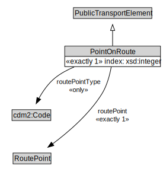

# PointOnRoute

A PointOnRoute represents an ordered RoutePoint for a PublicTransportRoute.

<a href="diagrams/PointOnRoute.dot.svg">Open interactive PointOnRoute diagram</a>

## Formalization for PointOnRoute

| Property | Constraint |
|----------|------------|
| index | exactly 1 owl:Thing |
| routePoint | exactly 1 owl:Thing |
| routePointType | all cdm2:Code |
| subClassOf | PublicTransportElement |

