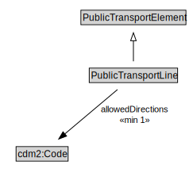

# PublicTransportLine

A PublicTransportLine is one or more routes used by public transport vehicles to transport passengers to and from designated locations.

<a href="diagrams/PublicTransportLine.dot.svg">Open interactive PublicTransportLine diagram</a>

## Formalization for PublicTransportLine

| Property | Constraint |
|----------|------------|
| allowedDirections | min 1 owl:Thing |
| cdm1:hasProperPart | all PublicTransportRoute |
| cdm1:hasProperPart | min 1 owl:Thing |
| cdm1:properPartOf | all GroupOfLines or PublicTransportSystem |
| subClassOf | PublicTransportElement |

## Used by classes

| Class | Property |
|-------|----------|
| [Group Of Lines](GroupOfLines.md) | cdm1:hasProperPart |
| [Public Transport Route](PublicTransportRoute.md) | cdm1:properPartOf |

