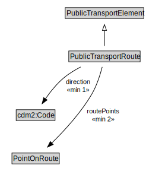

# PublicTransportRoute

A PublicTransportRoute represents one specific path used by a public transport vehicle to transport passengers to and from designated locations.

NOTE: For example, a PublicTransportLine might use an alternate PublicTransportRoute to reach its next stop during periods of congestion.

<a href="diagrams/PublicTransportRoute.dot.svg">Open interactive PublicTransportRoute diagram</a>

## Formalization for PublicTransportRoute

| Property | Constraint |
|----------|------------|
| cdm1:properPartOf | all PublicTransportLine |
| cdm1:properPartOf | min 1 owl:Thing |
| direction | min 1 owl:Thing |
| routePoints | min 2 owl:Thing |
| subClassOf | PublicTransportElement |

## Used by classes

| Class | Property |
|-------|----------|
| [Public Transport Line](PublicTransportLine.md) | cdm1:hasProperPart |

