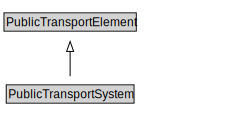

# PublicTransportSystem

A PublicTransportSystem provides transport services to members of the public.

<a href="diagrams/PublicTransportSystem.dot.svg">Open interactive PublicTransportSystem diagram</a>

## Formalization for PublicTransportSystem

| Property | Constraint |
|----------|------------|
| cdm1:hasProperPart | all GroupOfLines or PublicTransportLine |
| subClassOf | PublicTransportElement |

## Used by classes

| Class | Property |
|-------|----------|
| [Group Of Lines](GroupOfLines.md) | cdm1:properPartOf |

