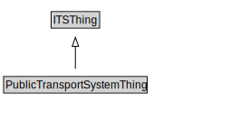

# PublicTransportSystemThing

<a href="diagrams/PublicTransportSystemThing.dot.svg">Open interactive PublicTransportSystemThing diagram</a>

## Specializations of PublicTransportSystemThing

| Class | Description |
|-------|-------------|
| [Group Of Lines](GroupOfLines.md) | A GroupOfLines is a logical grouping of PublicTransportLines for any useful purpose. |
| [Point On Route](PointOnRoute.md) | A PointOnRoute represents an ordered RoutePoint for a PublicTransportRoute. |
| [Public Transport Element](PublicTransportElement.md) |  |
| [Public Transport Line](PublicTransportLine.md) | A PublicTransportLine is one or more routes used by public transport vehicles to transport passengers to and from designated locations. |
| [Public Transport Route](PublicTransportRoute.md) | A PublicTransportRoute represents one specific path used by a public transport vehicle to transport passengers to and from designated locations. |
| [Public Transport System](PublicTransportSystem.md) | A PublicTransportSystem provides transport services to members of the public. |
| [Route Point](RoutePoint.md) | A RoutePoint represents a point of interest along a PublicTransportRoute. |

## Formalization for PublicTransportSystemThing

| Property | Constraint |
|----------|------------|
| subClassOf | ITSThing |

