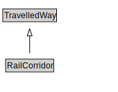

# RailCorridor

A RailCorridor is a type of TravelledWay that is made up of TrackLinks.

<a href="diagrams/RailCorridor.dot.svg">Open interactive RailCorridor diagram</a>

## Formalization for RailCorridor

| Property | Constraint |
|----------|------------|
| cdm1:hasProperPart | all TrackLink |
| cdm1:hasProperPart | min 1 owl:Thing |
| cdm1:properPartOf | all RailNetwork |
| subClassOf | TravelledWay |

## Other annotations

| Property | Value |
|----------|-------|
| xsd:pattern | RailNetworkPattern |

