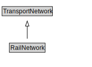

# RailNetwork

A RailNetwork is a type of TransportNetwork using rails on a stabilized base.

<a href="diagrams/RailNetwork.dot.svg">Open interactive RailNetwork diagram</a>

## Formalization for RailNetwork

| Property | Constraint |
|----------|------------|
| cdm1:hasProperPart | all RailCorridor or RailSection or TrackLink |
| cdm1:hasProperPart | min 1 owl:Thing |
| subClassOf | TransportNetwork |

## Used by classes

| Class | Property |
|-------|----------|
| [Rail Corridor](RailCorridor.md) | cdm1:properPartOf |
| [Rail Section](RailSection.md) | cdm1:properPartOf |

## Other annotations

| Property | Value |
|----------|-------|
| xsd:pattern | RailNetworkPattern |

