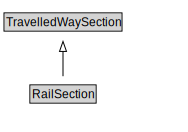

# RailSection

A RailSection is a type of TravelledWaySection that groups TrackLinks and TrackSegments for a useful operational purpose (e.g., assigning a speed limit, designating a traffic control scheme).

<a href="diagrams/RailSection.dot.svg">Open interactive RailSection diagram</a>

## Formalization for RailSection

| Property | Constraint |
|----------|------------|
| cdm1:hasProperPart | all TrackLink or TrackSegment |
| cdm1:properPartOf | all RailNetwork |
| subClassOf | TravelledWaySection |

## Other annotations

| Property | Value |
|----------|-------|
| xsd:pattern | RailNetworkPattern |

