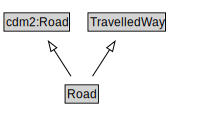

# Road

A Road is a type of TravelledWay and cdm2:Road that is made up of RoadLinks. Roads form a proper part of RoadNetworks.

<a href="diagrams/Road.dot.svg">Open interactive Road diagram</a>

## Specializations of Road

| Class | Description |
|-------|-------------|
| [Micromobility Path](MicromobilityPath.md) | A MicromobilityPath is a type of Road that is made up of MicromobilityPathLinks. |

## Formalization for Road

| Property | Constraint |
|----------|------------|
| cdm1:hasProperPart | all RoadLink |
| cdm1:hasProperPart | min 1 owl:Thing |
| cdm1:properPartOf | all RoadNetwork |
| subClassOf | TravelledWay |
| subClassOf | cdm2:Road |

