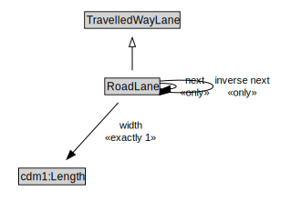

# RoadLane

A RoadLane is a type of TravelledWayLane that forms part of a RoadSegment.

<a href="diagrams/RoadLane.dot.svg">Open interactive RoadLane diagram</a>

## Specializations of RoadLane

| Class | Description |
|-------|-------------|
| [Micromobility Lane](MicromobilityLane.md) | A MicromobilityLane is a type of RoadLane that forms part of a MicromobilityPathSegment. |

## Formalization for RoadLane

| Property | Constraint |
|----------|------------|
| cdm1:properPartOf | all RoadSegment |
| cdm1:properPartOf | min 1 owl:Thing |
| inverse next | all RoadLane |
| next | all RoadLane |
| subClassOf | TravelledWayLane |
| width | exactly 1 owl:Thing |

## Used by classes

| Class | Property |
|-------|----------|
| [Road Lane](RoadLane.md) | next |
| [Road Lane](RoadLane.md) | previous |
| [Road Segment](RoadSegment.md) | cdm1:hasProperPart |

