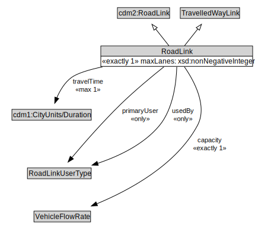

# RoadLink

A RoadLink is a type of TravelledWayLink and cdm2:RoadLink using a stabilized base designed for the movement of vehicles that conform to a specified set of requirements but may be used by others as well.

<a href="diagrams/RoadLink.dot.svg">Open interactive RoadLink diagram</a>

## Specializations of RoadLink

| Class | Description |
|-------|-------------|
| [Micromobility Link](MicromobilityLink.md) | A MicromobilityLink is a type of RoadLink designed for micromobility vehicles. |

## Formalization for RoadLink

| Property | Constraint |
|----------|------------|
| capacity | exactly 1 owl:Thing |
| cdm1:hasProperPart | all RoadSegment |
| cdm1:properPartOf | all Road or RoadNetwork or RoadSection |
| maxLanes | exactly 1 owl:Thing |
| primaryUser | all RoadLinkUserType |
| subClassOf | TravelledWayLink |
| subClassOf | cdm2:RoadLink |
| travelTime | max 1 owl:Thing |
| usedBy | all RoadLinkUserType |

## Used by classes

| Class | Property |
|-------|----------|
| [Road](Road.md) | cdm1:hasProperPart |
| [Road Link User Type](RoadLinkUserType.md) | uses |

