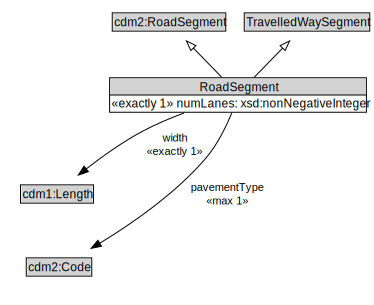

# RoadSegment

A RoadSegment is a type of TravelledWaySegment and transinfas:RoadSegment that represents a portion of a RoadLink with common physical characteristics.

<a href="diagrams/RoadSegment.dot.svg">Open interactive RoadSegment diagram</a>

## Specializations of RoadSegment

| Class | Description |
|-------|-------------|
| [Micromobility Path Segment](MicromobilityPathSegment.md) | A MicromobilityPathSegment is a type of RoadSegment that represents a portion of a MicromobilityLink with common physical characteristics. |

## Formalization for RoadSegment

| Property | Constraint |
|----------|------------|
| cdm1:hasProperPart | all RoadLane |
| cdm1:hasProperPart | min 1 owl:Thing |
| cdm1:properPartOf | all RoadLink or RoadSection |
| cdm1:properPartOf | exactly 1 owl:Thing |
| numLanes | exactly 1 owl:Thing |
| pavementType | max 1 owl:Thing |
| subClassOf | TravelledWaySegment |
| subClassOf | cdm2:RoadSegment |
| width | exactly 1 owl:Thing |

## Used by classes

| Class | Property |
|-------|----------|
| [Road Lane](RoadLane.md) | cdm1:properPartOf |
| [Road Link](RoadLink.md) | cdm1:hasProperPart |

