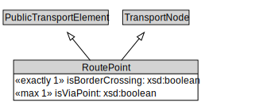

# RoutePoint

A RoutePoint represents a point of interest along a PublicTransportRoute.

<a href="diagrams/RoutePoint.dot.svg">Open interactive RoutePoint diagram</a>

## Formalization for RoutePoint

| Property | Constraint |
|----------|------------|
| isBorderCrossing | exactly 1 owl:Thing |
| isViaPoint | max 1 owl:Thing |
| subClassOf | PublicTransportElement |
| subClassOf | TransportNode |

