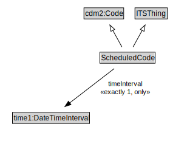

# ScheduledCode

The operational status of an entity, e.g., open or closed.

<a href="diagrams/ScheduledCode.dot.svg">Open interactive ScheduledCode diagram</a>

## Formalization for ScheduledCode

| Property | Constraint |
|----------|------------|
| subClassOf | ITSThing |
| subClassOf | cdm2:Code |
| timeInterval | all time1:DateTimeInterval |
| timeInterval | exactly 1 owl:Thing |

## Used by classes

| Class | Property |
|-------|----------|
| [Network Element](NetworkElement.md) | status |

## Other annotations

| Property | Value |
|----------|-------|
| xsd:pattern | TransportNetworkPattern |

