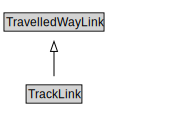

# TrackLink

A TrackLink is a type of TravelledWayLink that uses rails on a stabilized base.

<a href="diagrams/TrackLink.dot.svg">Open interactive TrackLink diagram</a>

## Formalization for TrackLink

| Property | Constraint |
|----------|------------|
| cdm1:hasProperPart | all TrackSegment |
| cdm1:properPartOf | all RailCorridor or RailNetwork or RailSection |
| subClassOf | TravelledWayLink |

## Used by classes

| Class | Property |
|-------|----------|
| [Rail Corridor](RailCorridor.md) | cdm1:hasProperPart |

## Other annotations

| Property | Value |
|----------|-------|
| xsd:pattern | RailNetworkPattern |

