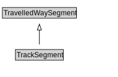

# TrackSegment

A TrackSegment is a type of TravelledWaySegment that represents a portion of a TrackLink with common physical characteristics.

<a href="diagrams/TrackSegment.dot.svg">Open interactive TrackSegment diagram</a>

## Formalization for TrackSegment

| Property | Constraint |
|----------|------------|
| cdm1:properPartOf | all RailSection or TrackLink |
| cdm1:properPartOf | exactly 1 owl:Thing |
| subClassOf | TravelledWaySegment |

## Used by classes

| Class | Property |
|-------|----------|
| [Track Link](TrackLink.md) | cdm1:hasProperPart |

## Other annotations

| Property | Value |
|----------|-------|
| xsd:pattern | RailNetworkPattern |

