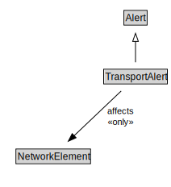

# TransportAlert

A TransportAlert is a type of alert that can be used to notify people of important transport information.

<a href="diagrams/TransportAlert.dot.svg">Open interactive TransportAlert diagram</a>

## Formalization for TransportAlert

| Property | Constraint |
|----------|------------|
| affects | all NetworkElement |
| subClassOf | Alert |

## Other annotations

| Property | Value |
|----------|-------|
| xsd:pattern | TransportAlertPattern |

