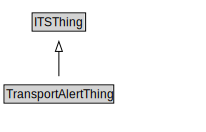

# TransportAlertThing

The transport alert pattern addresses the need for public agencies to alert groups to unusual transport-related conditions. Most of the features of the transport alert pattern can also be used for other types of alerts (e.g., meteorological events) and as such, its design includes the definition of a generalized alert.

<a href="diagrams/TransportAlertThing.dot.svg">Open interactive TransportAlertThing diagram</a>

## Formalization for TransportAlertThing

| Property | Constraint |
|----------|------------|
| subClassOf | ITSThing |

