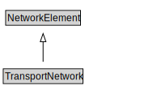

# TransportNetwork

A TransportNetwork is a NetworkElement that is a collection of other network elements that jointly represent a network of paths along which entities (e.g., vehicles, pedestrians) of a specified mode can operate.

<a href="diagrams/TransportNetwork.dot.svg">Open interactive TransportNetwork diagram</a>

## Specializations of TransportNetwork

| Class | Description |
|-------|-------------|
| [Footpath Network](FootpathNetwork.md) | A FootpathNetwork is a type of TransportNetwork designed for the use of pedestrians but may be used by others as well. |
| [Micromobility Network](MicromobilityNetwork.md) | A MicromobilityNetwork is a type of RoadNetwork designed for the use of micromobility vehicles, which have more limited performance characteristics than motor vehicles. |
| [Rail Network](RailNetwork.md) | A RailNetwork is a type of TransportNetwork using rails on a stabilized base. |
| [Road Network](RoadNetwork.md) | A RoadNetwork is a type of TransportNetwork using a stabilized base designed for the movement of vehicles, other than rail or air vehicles, that conform to a specified set of requirements but may be used by others as well. |

## Formalization for TransportNetwork

| Property | Constraint |
|----------|------------|
| cdm1:hasProperPart | all TransportNetwork or TransportNode or TravelledWay or TravelledWayLink or TravelledWaySection |
| cdm1:properPartOf | all TransportNetwork |
| subClassOf | NetworkElement |

## Used by classes

| Class | Property |
|-------|----------|
| [Transport Network](TransportNetwork.md) | cdm1:properPartOf |
| [Transport Node](TransportNode.md) | cdm1:properPartOf |
| [Travelled Way](TravelledWay.md) | cdm1:properPartOf |
| [Travelled Way Section](TravelledWaySection.md) | cdm1:properPartOf |

## Other annotations

| Property | Value |
|----------|-------|
| xsd:pattern | TransportNetworkPattern |

