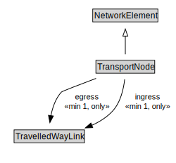

# TransportNode

A TransportNode is a NetworkElement that represents a node on the transport network that can be used to designate an end to a link or to join links.

<a href="diagrams/TransportNode.dot.svg">Open interactive TransportNode diagram</a>

## Specializations of TransportNode

| Class | Description |
|-------|-------------|
| [Junction](Junction.md) | A Junction is a TransportNode that allows a traveller to connect from one TravelledWayLink to another. |
| [Route Point](RoutePoint.md) | A RoutePoint represents a point of interest along a PublicTransportRoute. |

## Formalization for TransportNode

| Property | Constraint |
|----------|------------|
| cdm1:properPartOf | all TransportNetwork |
| cdm1:properPartOf | min 1 owl:Thing |
| egress | all TravelledWayLink |
| egress | min 1 owl:Thing |
| ingress | all TravelledWayLink |
| ingress | min 1 owl:Thing |
| subClassOf | NetworkElement |

## Used by classes

| Class | Property |
|-------|----------|
| [Travelled Way Link](TravelledWayLink.md) | from |
| [Travelled Way Link](TravelledWayLink.md) | to |

## Other annotations

| Property | Value |
|----------|-------|
| xsd:pattern | TransportNetworkPattern |

