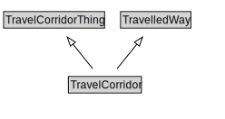

# TravelCorridor

A TravelCorridor is a type of TravelledWay that is made up of TravelCorridorLinks.

NOTE: The extent of a TravelCorridor is defined by the extent of the path that shares the designator assigned to the TravelCorridor.

<a href="diagrams/TravelCorridor.dot.svg">Open interactive TravelCorridor diagram</a>

## Formalization for TravelCorridor

| Property | Constraint |
|----------|------------|
| cdm1:hasProperPart | all TravelCorridorLink |
| cdm1:hasProperPart | min 1 owl:Thing |
| subClassOf | TravelCorridorThing |
| subClassOf | TravelledWay |

## Used by classes

| Class | Property |
|-------|----------|
| [Travel Corridor Link](TravelCorridorLink.md) | cdm1:hasProperPart |

