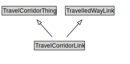

# TravelCorridorLink

A TravelCorridorLink is a type of TravelledWayLink that is made up of TravelCorridorSegments.

<a href="diagrams/TravelCorridorLink.dot.svg">Open interactive TravelCorridorLink diagram</a>

## Formalization for TravelCorridorLink

| Property | Constraint |
|----------|------------|
| cdm1:hasProperPart | all TravelCorridorSegment |
| cdm1:hasProperPart | all TravelCorridor |
| cdm1:hasProperPart | min 1 owl:Thing |
| subClassOf | TravelCorridorThing |
| subClassOf | TravelledWayLink |

## Used by classes

| Class | Property |
|-------|----------|
| [Travel Corridor](TravelCorridor.md) | cdm1:hasProperPart |
| [Travel Corridor Segment](TravelCorridorSegment.md) | cdm1:properPartOf |

