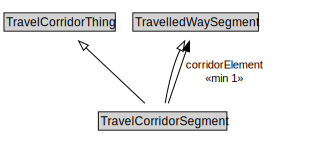

# TravelCorridorSegment

A TravelCorridorSegment is a type of TravelledWaySegment that logically groups multiple TravelledWaySegments together as being co-located or side-by-side.

<a href="diagrams/TravelCorridorSegment.dot.svg">Open interactive TravelCorridorSegment diagram</a>

## Formalization for TravelCorridorSegment

| Property | Constraint |
|----------|------------|
| cdm1:properPartOf | all TravelCorridorLink |
| corridorElement | min 1 owl:Thing |
| subClassOf | TravelCorridorThing |
| subClassOf | TravelledWaySegment |

## Used by classes

| Class | Property |
|-------|----------|
| [Travel Corridor Link](TravelCorridorLink.md) | cdm1:hasProperPart |
| [Travelled Way Segment](TravelledWaySegment.md) | travelCorridorSegment |

