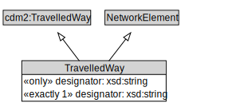

# TravelledWay

A TravelledWay is a type of NetworkElement and transinfras:TravelledWay that represents the curvilinear length of a transport route that is identified by a specific designator.

<a href="diagrams/TravelledWay.dot.svg">Open interactive TravelledWay diagram</a>

## Specializations of TravelledWay

| Class | Description |
|-------|-------------|
| [Footpath](Footpath.md) | A Footpath is a type of TravelledWay that is made up of FootpathLinks. |
| [Micromobility Path](MicromobilityPath.md) | A MicromobilityPath is a type of Road that is made up of MicromobilityPathLinks. |
| [Rail Corridor](RailCorridor.md) | A RailCorridor is a type of TravelledWay that is made up of TrackLinks. |
| [Road](Road.md) | A Road is a type of TravelledWay and cdm2:Road that is made up of RoadLinks. Roads form a proper part of RoadNetworks. |
| [Travel Corridor](TravelCorridor.md) | A TravelCorridor is a type of TravelledWay that is made up of TravelCorridorLinks. |

## Formalization for TravelledWay

| Property | Constraint |
|----------|------------|
| cdm1:hasProperPart | all TravelledWayLink |
| cdm1:properPartOf | all TransportNetwork |
| cdm1:properPartOf | min 1 owl:Thing |
| designator | all xsd:string |
| designator | exactly 1 owl:Thing |
| subClassOf | NetworkElement |
| subClassOf | cdm2:TravelledWay |

## Other annotations

| Property | Value |
|----------|-------|
| xsd:pattern | TransportNetworkPattern |

