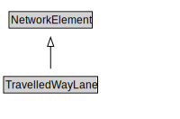

# TravelledWayLane

A TravelledWayLane is a NetworkElement that is a portion of TravelledWaySegment intended to accommodate a single line of moving material entities (e.g., vehicles) along its length.

<a href="diagrams/TravelledWayLane.dot.svg">Open interactive TravelledWayLane diagram</a>

## Specializations of TravelledWayLane

| Class | Description |
|-------|-------------|
| [Footpath Lane](FootpathLane.md) | A FootpathLane is a type of TravelledWayLane that forms part of a FootpathSegment. |
| [Micromobility Lane](MicromobilityLane.md) | A MicromobilityLane is a type of RoadLane that forms part of a MicromobilityPathSegment. |
| [Road Lane](RoadLane.md) | A RoadLane is a type of TravelledWayLane that forms part of a RoadSegment. |

## Formalization for TravelledWayLane

| Property | Constraint |
|----------|------------|
| cdm1:properPartOf | all TravelledWaySegment |
| cdm1:properPartOf | min 1 owl:Thing |
| subClassOf | NetworkElement |

## Used by classes

| Class | Property |
|-------|----------|
| [Travelled Way Segment](TravelledWaySegment.md) | cdm1:hasProperPart |

## Other annotations

| Property | Value |
|----------|-------|
| xsd:pattern | TransportNetworkPattern |

