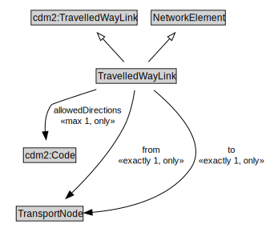

# TravelledWayLink

A TravelledWayLink is a type of NetworkElement and transinfras:TravelledWayLink. It represents a contiguous length of a TravelledWay between two TransportNodes of operational or managerial significance.

<a href="diagrams/TravelledWayLink.dot.svg">Open interactive TravelledWayLink diagram</a>

## Specializations of TravelledWayLink

| Class | Description |
|-------|-------------|
| [Footpath Link](FootpathLink.md) | A Footpath Link is a type of TravelledWayLink designed for pedestrians. |
| [Micromobility Link](MicromobilityLink.md) | A MicromobilityLink is a type of RoadLink designed for micromobility vehicles. |
| [Road Link](RoadLink.md) | A RoadLink is a type of TravelledWayLink and cdm2:RoadLink using a stabilized base designed for the movement of vehicles that conform to a specified set of requirements but may be used by others as well. |
| [Track Link](TrackLink.md) | A TrackLink is a type of TravelledWayLink that uses rails on a stabilized base. |
| [Travel Corridor Link](TravelCorridorLink.md) | A TravelCorridorLink is a type of TravelledWayLink that is made up of TravelCorridorSegments. |

## Formalization for TravelledWayLink

| Property | Constraint |
|----------|------------|
| allowedDirections | all cdm2:Code |
| allowedDirections | max 1 owl:Thing |
| cdm1:hasProperPart | all TravelledWaySegment |
| cdm1:properPartOf | all TransportNetwork or TravelledWay or TravelledWaySection |
| cdm1:properPartOf | min 1 owl:Thing |
| from | all TransportNode |
| from | exactly 1 owl:Thing |
| subClassOf | NetworkElement |
| subClassOf | cdm2:TravelledWayLink |
| to | all TransportNode |
| to | exactly 1 owl:Thing |

## Used by classes

| Class | Property |
|-------|----------|
| [Transport Node](TransportNode.md) | egress |
| [Transport Node](TransportNode.md) | ingress |
| [Travelled Way](TravelledWay.md) | cdm1:hasProperPart |

## Other annotations

| Property | Value |
|----------|-------|
| xsd:pattern | TransportNetworkPattern |

