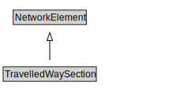

# TravelledWaySection

A TravelledWaySection is a type of NetworkElement that represents an aggregation of TravelledWayLinks and TravelledWaySegments that jointly represent a contiguous length of a path that shares the same management and operational strategies (within the scope of interest of the implementation).

<a href="diagrams/TravelledWaySection.dot.svg">Open interactive TravelledWaySection diagram</a>

## Specializations of TravelledWaySection

| Class | Description |
|-------|-------------|
| [Footpath Section](FootpathSection.md) | A FootpathSection is a type of TravelledWaySection that groups FootpathLinks and FootpathSegments for a useful operational purpose. |
| [Micromobility Path Section](MicromobilityPathSection.md) | A MicromobilityPathSections is a type of RoadSection that groups MicromobilityLinks and MicromobilityPathSegments for a useful operational purpose (e.g., assigning a speed limit, designating areas of shared use). |
| [Rail Section](RailSection.md) | A RailSection is a type of TravelledWaySection that groups TrackLinks and TrackSegments for a useful operational purpose (e.g., assigning a speed limit, designating a traffic control scheme). |
| [Road Section](RoadSection.md) | A RoadSection is a type of TravelledWaySection that groups RoadLinks and RoadSegments for a useful operational purpose (e.g., assigning a speed limit, designating a traffic control scheme). |

## Formalization for TravelledWaySection

| Property | Constraint |
|----------|------------|
| cdm1:hasProperPart | all TravelledWayLink or TravelledWaySegment |
| cdm1:properPartOf | all TransportNetwork |
| cdm1:properPartOf | min 1 owl:Thing |
| subClassOf | NetworkElement |

## Other annotations

| Property | Value |
|----------|-------|
| xsd:pattern | TransportNetworkPattern |

