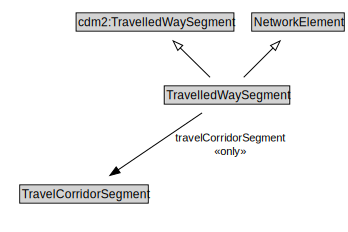

# TravelledWaySegment

A TravelledWaySegment is a type of a transinfras:TravelledWaySegment and NetworkElement that represents a contiguous length of a TravelledWayLink characterized by the same physical characteristics.

<a href="diagrams/TravelledWaySegment.dot.svg">Open interactive TravelledWaySegment diagram</a>

## Specializations of TravelledWaySegment

| Class | Description |
|-------|-------------|
| [Footpath Segment](FootpathSegment.md) | A FootpathSegment is a type of TravelledWaySegment that represents a portion of a FootpathLink with common physical characteristics. |
| [Micromobility Path Segment](MicromobilityPathSegment.md) | A MicromobilityPathSegment is a type of RoadSegment that represents a portion of a MicromobilityLink with common physical characteristics. |
| [Road Segment](RoadSegment.md) | A RoadSegment is a type of TravelledWaySegment and transinfas:RoadSegment that represents a portion of a RoadLink with common physical characteristics. |
| [Track Segment](TrackSegment.md) | A TrackSegment is a type of TravelledWaySegment that represents a portion of a TrackLink with common physical characteristics. |
| [Travel Corridor Segment](TravelCorridorSegment.md) | A TravelCorridorSegment is a type of TravelledWaySegment that logically groups multiple TravelledWaySegments together as being co-located or side-by-side. |

## Formalization for TravelledWaySegment

| Property | Constraint |
|----------|------------|
| cdm1:hasProperPart | all TravelledWayLane |
| cdm1:hasProperPart | min 1 owl:Thing |
| cdm1:properPartOf | all TravelledWayLink or TravelledWaySection |
| cdm1:properPartOf | min 1 owl:Thing |
| subClassOf | NetworkElement |
| subClassOf | cdm2:TravelledWaySegment |
| travelCorridorSegment | all TravelCorridorSegment |

## Used by classes

| Class | Property |
|-------|----------|
| [Travelled Way Lane](TravelledWayLane.md) | cdm1:properPartOf |
| [Travelled Way Link](TravelledWayLink.md) | cdm1:hasProperPart |

## Other annotations

| Property | Value |
|----------|-------|
| xsd:pattern | TransportNetworkPattern |

