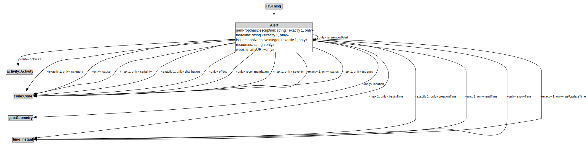

# Alert

## Restrictions

| Property | Restriction Type |
|----------|------------------|
| activities | All values from activity:Activity |
| beginTime | All values from time:Instant |
| category | All values from code:Code |
| cause | All values from code:Code |
| certainty | All values from code:Code |
| creationTime | All values from time:Instant |
| distribution | All values from code:Code |
| effect | All values from code:Code |
| endTime | All values from time:Instant |
| expiryTime | All values from time:Instant |
| genProp:hasDescription | All values from xsd:string |
| headline | All values from xsd:string |
| issuer | All values from xsd:nonNegativeInteger |
| lastUpdateTime | All values from time:Instant |
| location | All values from geo:Geometry |
| recommendation | All values from code:Code |
| referencedAlert | All values from Alert |
| resources | All values from xsd:anyURI |
| severity | All values from code:Code |
| status | All values from code:Code |
| urgency | All values from code:Code |
| website | All values from xsd:anyURI |

## Other Annotations

- **terms:description**: An Alert can be used to notify people of important information.
- **xsd:pattern**: TransportAlertPattern

