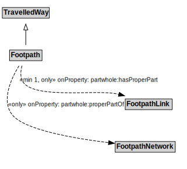

# Footpath

## Restrictions

| Property | Restriction Type |
|----------|------------------|
| partwhole:hasProperPart | All values from FootpathLink |
| partwhole:properPartOf | All values from FootpathNetwork |

## Other Annotations

- **terms:description**: A Footpath is a type of TravelledWay that is made up of FootpathLinks.
- **xsd:pattern**: PedestrianNetworkPattern

