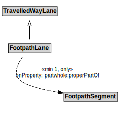

# FootpathLane

## Restrictions

| Property | Restriction Type |
|----------|------------------|
| partwhole:properPartOf | All values from FootpathSegment |

## Other Annotations

- **terms:description**: A FootpathLane is a type of TravelledWayLane that forms part of a FootpathSegment.
- **xsd:pattern**: PedestrianNetworkPattern

