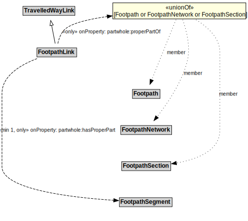

# FootpathLink

A Footpath Link is a type of TravelledWayLink designed for pedestrians.

## Formalization

| Property | Value Restriction |
|----------|-------------------|
| partwhole:hasProperPart | min 1 [FootpathSegment](FootpathSegment.md) |
| partwhole:hasProperPart | only [FootpathSegment](FootpathSegment.md) |
| partwhole:properPartOf | only ([Footpath](Footpath.md) or [FootpathNetwork](FootpathNetwork.md) or [FootpathSection](FootpathSection.md)) |
| rdfs:subClassOf | [TravelledWayLink](TravelledWayLink.md) |

## Other Annotations

- **xsd:pattern**: [PedestrianNetworkPattern](PedestrianNetworkPattern.md)

