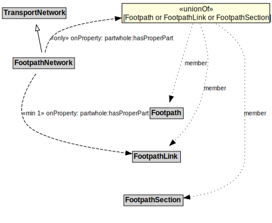

# FootpathNetwork

## Other Annotations

- **terms:description**: A FootpathNetwork is a type of TransportNetwork designed for the use of pedestrians but may be used by others as well.
- **xsd:pattern**: PedestrianNetworkPattern

