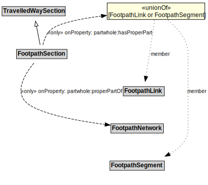

# FootpathSection

## Restrictions

| Property | Restriction Type |
|----------|------------------|
| partwhole:properPartOf | All values from FootpathNetwork |

## Other Annotations

- **terms:description**: A FootpathSection is a type of TravelledWaySection that groups FootpathLinks and FootpathSegments for a useful operational purpose.
- **xsd:pattern**: PedestrianNetworkPattern

