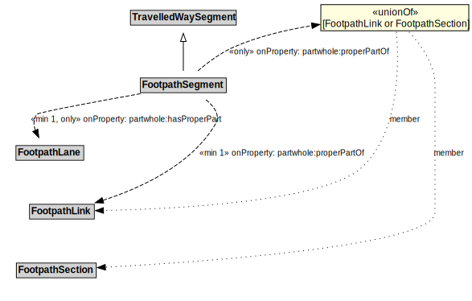

# FootpathSegment

A FootpathSegment is a type of TravelledWaySegment that represents a portion of a FootpathLink with common physical characteristics.

## Formalization

| Property | Value Restriction |
|----------|-------------------|
| partwhole:hasProperPart | min 1 [FootpathLane](FootpathLane.md) |
| partwhole:hasProperPart | only [FootpathLane](FootpathLane.md) |
| partwhole:properPartOf | min 1 [FootpathLink](FootpathLink.md) |
| partwhole:properPartOf | only ([FootpathLink](FootpathLink.md) or [FootpathSection](FootpathSection.md)) |
| rdfs:subClassOf | [TravelledWaySegment](TravelledWaySegment.md) |

## Other Annotations

- **xsd:pattern**: [PedestrianNetworkPattern](PedestrianNetworkPattern.md)

